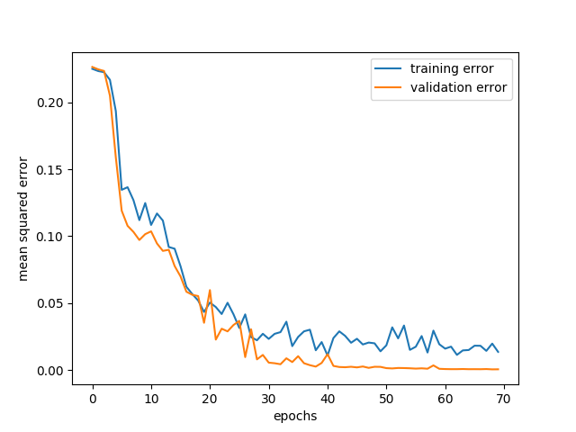

# Vanilla Feedforward Neural Network

Code Assignment for Ascent Robotics

## Synopsis

### Requirements
- The neural network implementation is developed under python 3.6.0 with numpy 1.14.0.
- The Iris example requires scikit-learn to load.
- Exact environment during development can be reproduced with `pip install -r requirements.txt`.

### Running the Iris example
Run `python3 iris_learn.py` with the working directory set as the parent directory of **nnet/**

## Files

### Main Directory
**iris_learn.py**
- Example usage of the neural network model on the Iris dataset.
- See previous section for instructions on how to run this file.

**requirements.txt**
- Requirement file for pip.

**iris_trend.txt**
- Graph of training and validation errors over time of the implementation on the Iris dataset.

### nnet/
**activations.py**
- Contains activation functions.
- Currently available activation functions: sigmoid, softmax.

**optimizers.py**
- Contains optimization methods for training.
- Currently available optimizers: sgd, Adam.

**layers.py**
- Contains layers that construct the network.
- Currently available layers: Dense, Dropout.

**models.py**
- Contains the main neural network model.

## Assignment Report

### Design Considerations
The interface of the neural network was inspired by previous experiences with Keras. 

In order to maintain simplicity on the outermost level while retaining the flexibility to configure different aspects of the neural network, different activation functions, optimizers, and layers are created as modules that can then be imported to define the architecture of the neural network.

### Learning the Iris Dataset
Dataset information:
- Number of features: 4
- Classification categories: 3
- Data entries: 150

#### Data Preprocessing
The features are normalized to zero mean and unit variance so the features possess equal influence. Labels were originally given as category numbers, so we create an array of length 3 for each entry as a representation of the individual probabilities of each category, with a value of 1 as the element corresponding to the label and 0 for the others.

With only 150 data entries, the information that each entry possess is very valuable. To achieve an acceptable accuracy in evaluating the performance while retaining as much data for training as possible, we only split 30 entries for the test set. 

#### Neural Network Design
With only 4 features and 3 categories, layers do not need to be too wide, and since we are using logistic sigmoid activation functions, networks with too many layers will suffer from vanishing gradients severly. Thus, the neural network configuration chosen has two hidden layers with 64 and 16 neurons respectively. 

To evaluate the probabilities of each of the 3 categories, we use a softmax activation function for the output layer. The advantage of softmax over sigmoid is that it respects the fact that all probabilites add up to 1, so learning a decreased probability in one category translates to increased probabilities in other categories.

The Adam optimizer is chosen as the weight updating method for its general effectiveness in broad applications. Also, to prevent overfitting, dropout is added to the hidden layers and a L2 regularizer is added to the weight updating process.

#### Training Process
The training process is done in batches of data, which are randomly sampled from the training data. Program runtime is not a big issue with only 150 data entries to go over, so small batches of size 5 is used.

An early stopping mechanism was orignally implemented in the training process to terminate training when validation error increases. However, the final network has little signs of overfitting, and having more data to train over seemed relatively desirable. Thus the early stopping was disabled and the validation rate is set to a low value of 0.04, which corresponds to 5 entries in the remaining 120 entries of training data, since it does not affect the training process anymore and is only an indicator of how well the network is doing in the training process. 

A maximum epoch of 70 was chosen after several runs of the training process.

### Performance Analysis
The training error and validation error trends while learning the Iris dataset can be seen below:

Prediction accuracy on the test set over 10 independent runs:  
96.67%, 93.33%, 96.67%, 100%, 93.33%, 100%, 96.67%, 96.67%, 100%, 96.67%

Mean accuracy: 97%

Thus, this configuration is fairly accurate for the iris dataset.
